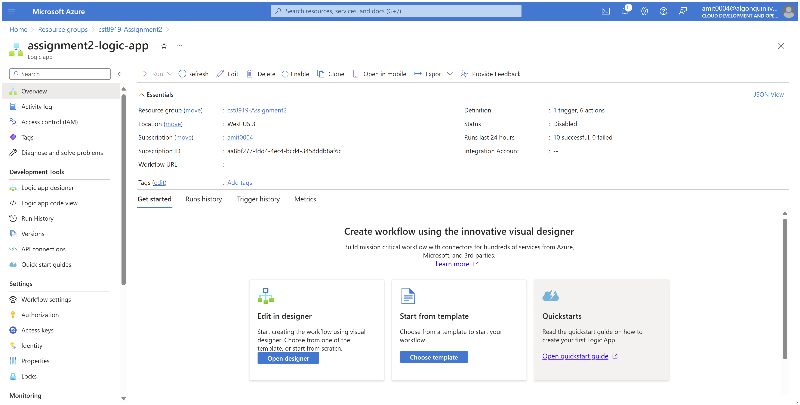
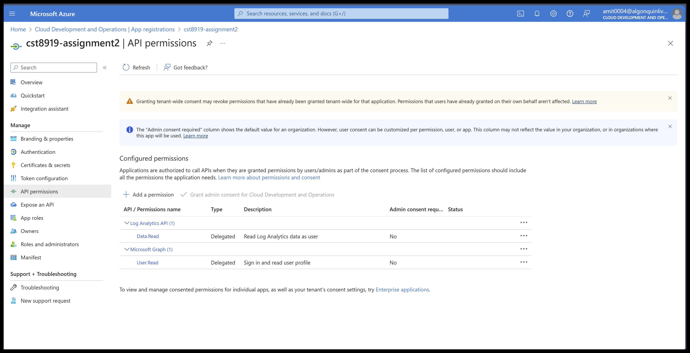
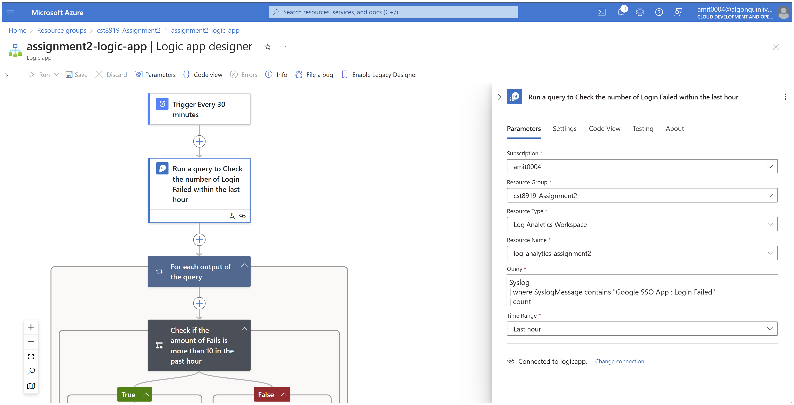
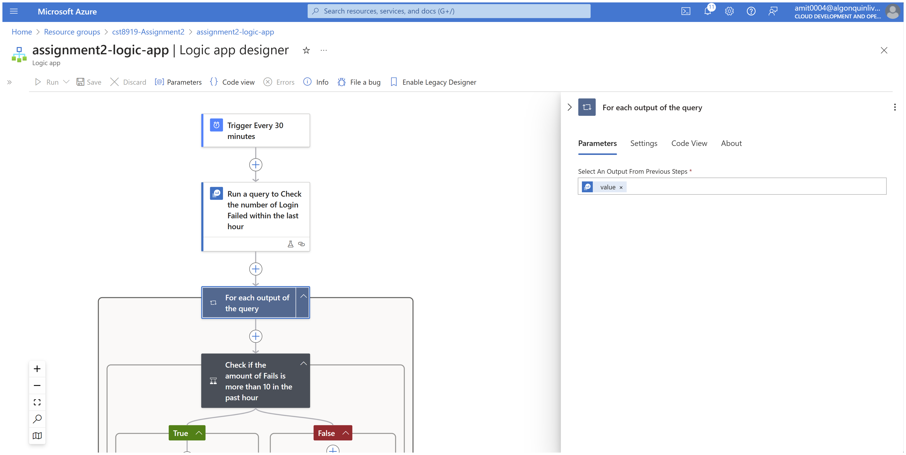
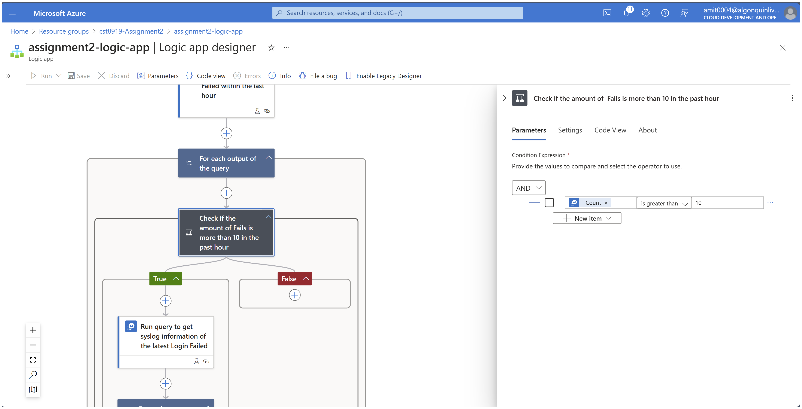
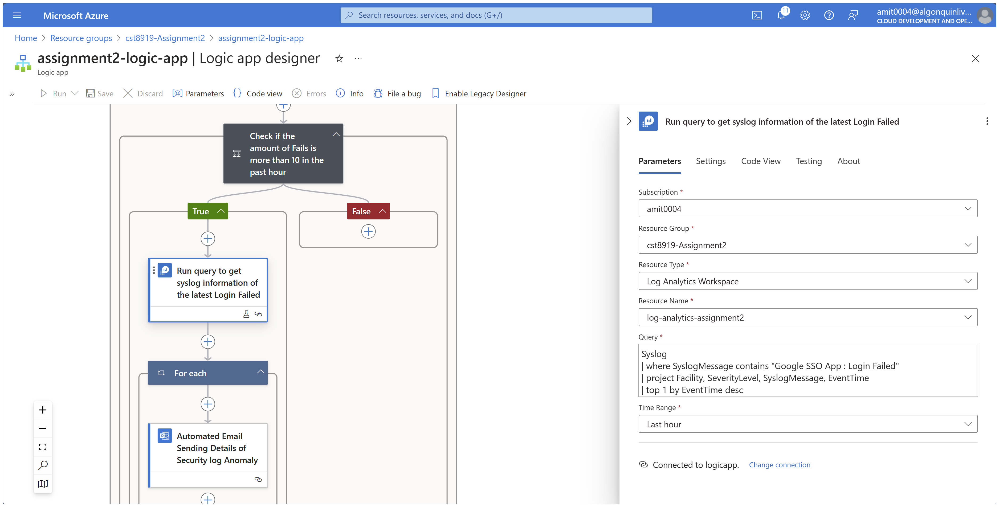
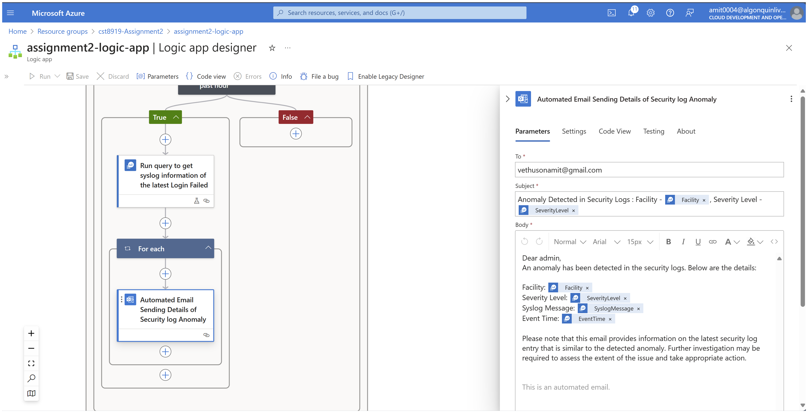
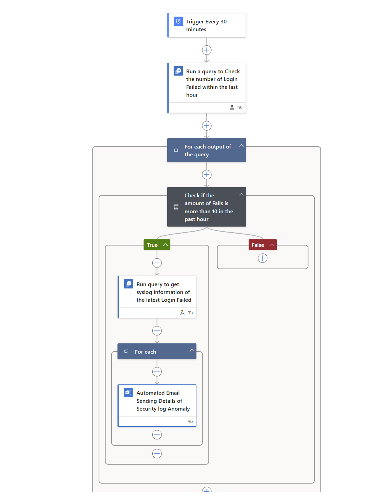

# **Assignment 2: Automating Anomaly Detection and Alerting in Cloud Security**

## **Part 1: Understanding Anomaly Detection**

## **Part 2: Preparing for Automation**
Azure logic App Set up

## **Part 3: Implementing Anomaly Detection**

## **Part 4: Integrating Cloud Security Best Practices**
